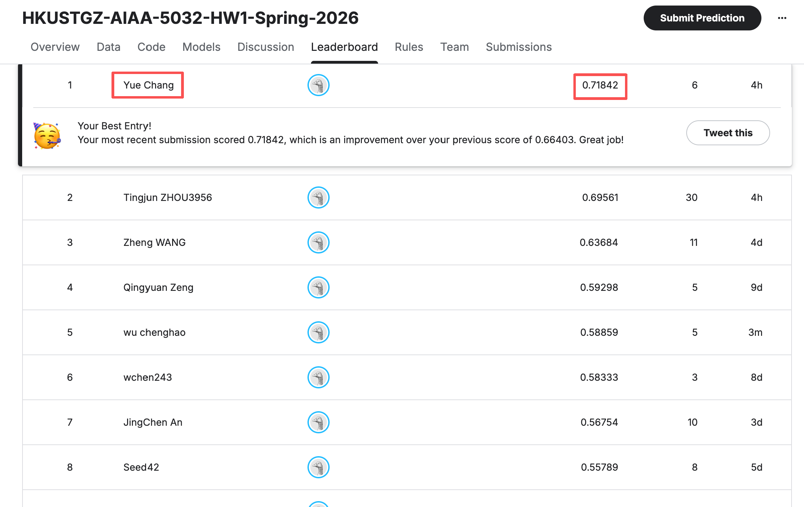

# AIAA5032 HW1 — Audio-Based Video Classification

## Leaderboard (Feb 19, 2026) — Kaggle name: Yue Chang
Approach: BiLSTM + 5-Fold Cross-Validation Ensemble + Test-Time Augmentation (TTA)





## Directory Structure

```
hw1/
├── run_bilstm_kfold.py   ← MAIN script (best result)
├── run_bilstm.py         ← Single BiLSTM (single-split reference)
├── infer_bilstm.py       ← Run inference from a saved checkpoint
├── split_train_val.py    ← Split trainval.csv → train.csv + val.csv
├── select_frames.py      ← MFCC frame sampling utility (from baseline)
├── labels/               ← trainval.csv, train.csv, val.csv, test_for_student.label
├── experiments/          ← Saved experiment outputs
└── old_scripts/          ← Earlier attempts (for reference)
    ├── baseline/         ← BoF + SVM / LR / MLP baselines
    ├── mlp/              ← MLP hyperparameter search, PCA-MLP, Bagging-MLP
    ├── fisher_vector/    ← GMM + Fisher Vector pipeline
    ├── xgboost/          ← XGBoost experiments
    ├── cnn/              ← 1D-CNN experiment
    └── ensemble/         ← Post-hoc ensemble scripts
```

---

## Environment

```bash
conda create -n hw1 python=3.11
conda activate hw1
pip install torch==2.0.1 scikit-learn numpy
```

> Tested on Ubuntu 22.04, CUDA 11.8. CPU-only also works (slower).

---

## Reproduction 

### 1. Prepare labels

```bash
mkdir -p labels/
# Place trainval.csv and test_for_student.label under labels/
python split_train_val.py   # generates labels/train.csv and labels/val.csv
```

### 2. Unzip MFCC features

```bash
tar zxvf mfcc.tgz
```

### 3. Run BiLSTM K-Fold training (produces test predictions)

```bash
python run_bilstm_kfold.py \
    /path/to/mfcc/ \
    labels/trainval.csv \
    labels/test_for_student.label \
    --epochs 150 --patience 20 \
    --n_folds 5 --n_tta 8 \
    --label_smoothing 0.1
```

Output: `experiments/bilstm_kfold_<timestamp>/test_kfold_tta.csv`

Upload that CSV to Kaggle.

<!-- ### Key Arguments

| Argument | Default | Description |
|---|---|---|
| `--hidden_dim` | 256 | BiLSTM hidden size per direction |
| `--num_layers` | 2 | Number of LSTM layers |
| `--dropout` | 0.5 | Dropout rate |
| `--lr` | 1e-3 | Initial learning rate |
| `--epochs` | 150 | Max epochs per fold (early stopping applies) |
| `--patience` | 20 | Early stopping patience |
| `--n_folds` | 5 | Number of CV folds |
| `--n_tta` | 8 | TTA passes at inference |
| `--label_smoothing` | 0.1 | Label smoothing coefficient |

--- -->

## Method

### Model: Bidirectional LSTM with Attention Pooling

```
Input MFCC (T × 39)
    → BatchNorm
    → BiLSTM (2 layers, hidden=256, bidirectional)
    → Attention Pooling (learnable scalar weights over time)
    → FC(512 → 256) → ReLU → Dropout
    → FC(256 → 10)
```

Variable-length sequences are handled via PyTorch `pack_padded_sequence`.

### Data Augmentation (training only)

Applied per-sample at every training step:

- **Speed perturbation**: randomly stretch/compress time axis by ×0.8–1.2
- **Time masking**: 2 × up to 10% of frames zeroed out
- **Frequency masking**: 2 × up to 15% of MFCC bins zeroed out
- **Gaussian noise**: σ = 0.05 added to all frames
- **CMVN**: cepstral mean-variance normalisation per utterance

### Training Strategies

| Strategy | Details |
|---|---|
| **5-Fold Stratified CV** | Each fold: 80% train / 20% val; 5 independent models |
| **Label Smoothing** | ε = 0.1; prevents overconfident predictions |
| **Cosine LR Schedule** | LR decays from 1e-3 → 1e-5 over `--epochs` steps |
| **Gradient Clipping** | max norm = 5.0 |
| **Early Stopping** | patience = 20 on fold val accuracy |
| **TTA at inference** | Each test sample augmented 8 times; softmax averaged |
| **Ensemble** | Final prediction = average of 5 × 8 = 40 soft predictions |

---


## Experiment Journey (see `old_scripts/`)

~5,000 training samples, 10 classes — overfitting is the central challenge throughout.

| Method | Val Acc | Kaggle Score |
|---|---|---|
| BoF (k=50) + SVM | ~55% | — |
| BoF (k=50) + MLP | ~58% | — |
| Fisher Vector (k=200) + MLP | ~67% | 0.629 |
| Fisher Vector (k=300) + MLP | ~69% | — |
| BiLSTM (single model, train split) | 69.4% | 0.66 |
| **BiLSTM K-Fold + TTA + Label Smoothing** | **68.6% (CV mean)** | **0.71842 (1st)** |

---

### Stage 1 — BoF + Classical Classifiers (`old_scripts/baseline/`)

K-Means codebook (k=50) → Bag-of-Features histogram → SVM / LR / MLP.
BoF loses temporal ordering and quantises coarsely. MLP performed best (~58%) and was kept as
the classifier head for subsequent classical experiments.

---

### Stage 2 — Fisher Vector (`old_scripts/fisher_vector/`)

Replaced BoF with Fisher Vector encoding: GMM soft assignment captures both first- and
second-order statistics, producing a much richer fixed-length representation.

| Features | Val Acc | Kaggle |
|---|---|---|
| Fisher Vector k=200 → MLP | 67.65% | 0.629 |
| Fisher Vector k=300 → MLP | 69.18% | — |

Scaling GMM components from 200 to 300 added ~1.5 pp. This became the strongest classical baseline.

---

### Stage 3 — Squeezing the Classical Pipeline (`old_scripts/mlp/`, `old_scripts/xgboost/`)

Several attempts to push Fisher Vector further:

| Attempt | Val Acc | Outcome |
|---|---|---|
| XGBoost on FV k=200 | 66.24% | Worse — high-dim dense features don't suit trees |
| MLP arch search (512, 256) | 68.12% | Marginal gain |
| PCA-256 + MLP | 65.41% | Worse — PCA discarded ~30% of variance |
| Bagging MLP (10 models) | 67.18% | No gain — bottleneck was features, not variance |

Classical pipeline plateaued at ~69%. Temporal structure was the missing ingredient.

---

### Stage 4 — BiLSTM (`run_bilstm.py`)

Switched to operating directly on raw variable-length MFCC sequences.
Architecture: 2-layer BiLSTM → Attention Pooling → FC classifier.

Severe overfitting (train ~85%, val ~65%, gap > 20 pp). Fixes tried:

| Attempt | Val Acc |
|---|---|
| Base (hidden=256, dropout=0.5) | ~68% |
| Smaller model (hidden=128, dropout=0.7) | 66.6% |
| + Speed perturbation + SpecAugment masking + noise | **69.41%** |

Data augmentation was the decisive factor, matching the Fisher Vector MLP.

---

### Stage 5 — 1D-CNN (`old_scripts/cnn/`)

Residual 1D-CNN with masked global average pooling. Val 63.29%, training unstable (loss
oscillating 1.3 → 3.9). Abandoned.

---

### Stage 6 — K-Fold + TTA + Label Smoothing (`run_bilstm_kfold.py`)

Single-split BiLSTM (69.41% val) scored only 0.66 on Kaggle. Three techniques were stacked
to reduce variance and improve calibration:

- **5-Fold CV:** 5 independent models trained on different 80/20 splits — diverse predictions
- **TTA ×8:** each test sample augmented 8 times at inference, softmax averaged
- **Label smoothing ε=0.1:** soft targets prevent overconfident predictions

Final prediction: average of 5 × 8 = **40 soft outputs** per sample.

| | CV Mean | Kaggle |
|---|---|---|
| Single BiLSTM | 69.41% | 0.66 |
| **K-Fold + TTA + LS** | **68.57%** | **0.72 (1st)** |
